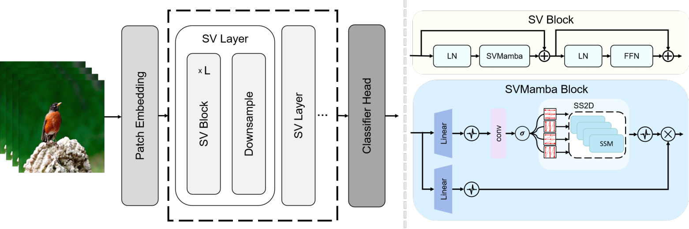

# 低能耗的脉冲视觉模型研究

## 环境配置
```
conda create -n SVMamba python==3.9
conda activate SVMamba
pip install -r requirements.txt
# 实验使用 mamba_ssm 1.1.4 causal_conv1d 1.1.3.post1 在 cuda11.8 torch 2.2.0 下进行
pip install https://github.com/state-spaces/mamba/releases/download/v1.1.4/mamba_ssm-1.1.4+cu118torch2.2cxx11abiFALSE-cp39-cp39-linux_x86_64.whl
pip install https://github.com/Dao-AILab/causal-conv1d/releases/download/v1.3.0.post1/causal_conv1d-1.3.0.post1+cu118torch2.2cxx11abiFALSE-cp38-cp38-linux_x86_64.whl
```

## 文件组织
数据集请放在data文件夹下
```
SNN_Mamba
├── data
│   ├── cifar-10
│   │   └── cifar-10-batches-py
│   ├── cifar-100
│   │   ├── cifar-100-python
│   └── Mini-ImageNet-Dataset
│       ├── test
│       ├── train
│       └── val
```

## 模型训练
模型的配置文件可参考configs文件夹下yaml文件，根据自身需要修改
```
python train.py --config path_to_your_yaml_config_file
```
关键实验参数列举：
- task_name: 实验任务名称
- model: 模型名称
- dataset: 数据集名称
- root_path: 数据集根路径
- img_size: 图像大小
- batch_size: 批大小
- lr: 学习率
- pretrained: 是否预训练
- checkpoint: 模型权重
## 模型测试
```
python test.py -config path_to_your_yaml_config_file
```
## 指定图片测试
class2index json文件用于将数据集中类别编号转换为具体类别，Mini-ImageNet的对应文件可使用[json](https://drive.google.com/file/d/1LXD84iNkVhWxHhozJW_K2e9H9meKHNm5/view?usp=drive_link)
```
python predict.py --config path_to_your_yaml_config_file --class_index_json path_to_class2index_json_file --img_folder path_to_your_images_folder
```
## 预训练模型权重
[模型权重](https://drive.google.com/file/d/1LZq5TSvojybLq5AYEj0uLhz8tlY0h7Fb/view?usp=sharing)

## 参考
如果你觉得这个仓库对你的研究有帮助，请考虑引用以下原始工作：
- [VMamba](https://github.com/MzeroMiko/VMamba)
- [QKFormer](https://github.com/zhouchenlin2096/QKFormer/tree/master)
```
@article{liu2024vmamba,
    title={VMamba: Visual State Space Model},
    author={Liu, Yue and Tian, Yunjie and Zhao, Yuzhong and Yu, Hongtian and Xie, Lingxi and Wang, Yaowei and Ye, Qixiang and Liu, Yunfan},
    journal={arXiv preprint arXiv:2401.10166},
    year={2024}
}

@inproceedings{
    zhou2024qkformer,
    title={{QKF}ormer: Hierarchical Spiking Transformer using Q-K Attention},
    author={Chenlin Zhou and Han Zhang and Zhaokun Zhou and Liutao Yu and Liwei Huang and Xiaopeng Fan and Li Yuan and Zhengyu Ma and Huihui Zhou and Yonghong Tian},
    booktitle={The Thirty-eighth Annual Conference on Neural Information Processing Systems},
    year={2024},
    url={https://openreview.net/forum?id=AVd7DpiooC}
}

@article{zhou2024direct,
    title={Direct training high-performance deep spiking neural networks: a review of theories and methods},
    author={Zhou, Chenlin and Zhang, Han and Yu, Liutao and Ye, Yumin and Zhou, Zhaokun and Huang, Liwei and Ma, Zhengyu and Fan, Xiaopeng and Zhou, Huihui and Tian, Yonghong},
    journal={Frontiers in Neuroscience},
    volume={18},
    pages={1383844},
    year={2024},
    publisher={Frontiers Media SA}
}

@article{zhang2024sglformer,
    title={SGLFormer: Spiking Global-Local-Fusion Transformer with high performance},
    author={Zhang, Han and Zhou, Chenlin and Yu, Liutao and Huang, Liwei and Ma, Zhengyu and Fan, Xiaopeng and Zhou, Huihui and Tian, Yonghong},
    journal={Frontiers in Neuroscience},
    volume={18},
    pages={1371290},
    year={2024},
    publisher={Frontiers Media SA}
}

@article{zhou2023spikingformer,
    title={Spikingformer: Spike-driven residual learning for transformer-based spiking neural network},
    author={Zhou, Chenlin and Yu, Liutao and Zhou, Zhaokun and Ma, Zhengyu and Zhang, Han and Zhou, Huihui and Tian, Yonghong},
    journal={arXiv preprint arXiv:2304.11954},
    year={2023}
}
```
